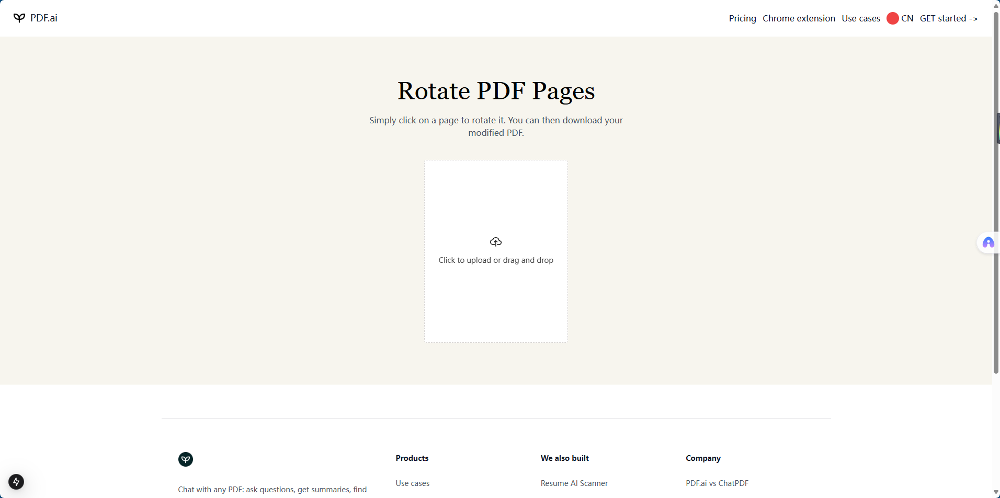
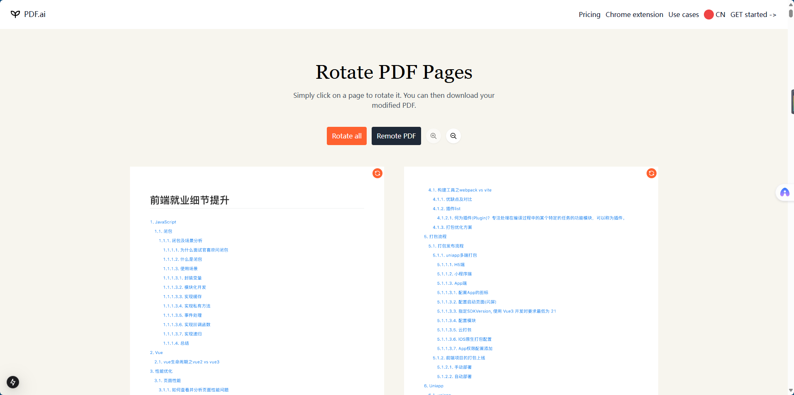
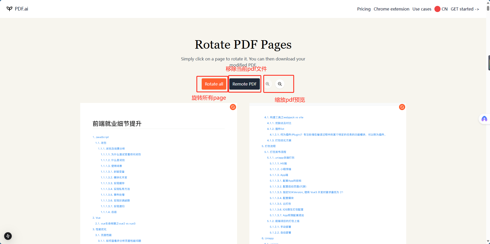
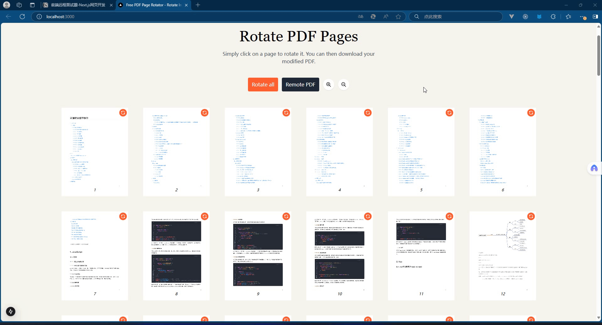
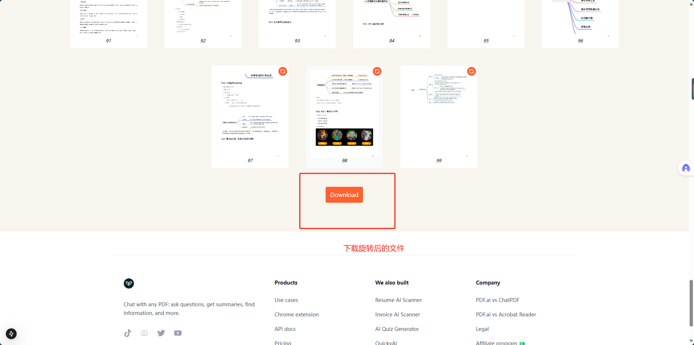
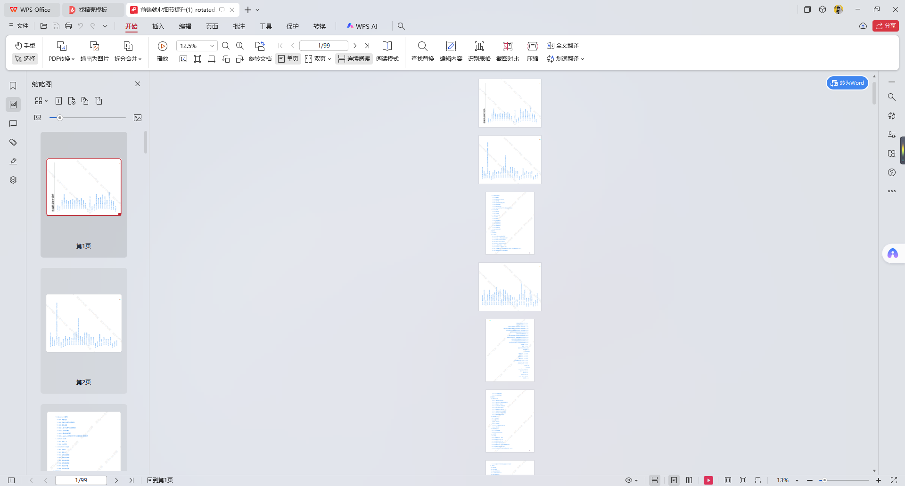

# PDF 反转处理工具项目文档

## 🔗 项目链接

- **GitHub 仓库**  
  [https://github.com/6iKUN6/20250128.git](https://github.com/6iKUN6/20250128.git)
- **Vercel 在线预览**  
  [20250128-cxks-projects-ed724242.vercel.app](https://20250128-cxks-projects-ed724242.vercel.app)

## 🛠️ 环境要求

```bash
Node.js >= 22.x
pnpm >= 9.15.x  # 需支持 Promise.withResolvers
```

# PDF 反转处理工具项目文档

## 🔗 项目链接

- **GitHub 仓库**
  [https://github.com/6iKUN6/20250128.git](https://github.com/6iKUN6/20250128.git)
- **Vercel 在线预览**
  [20250128-cxks-projects-ed724242.vercel.app](https://20250128-cxks-projects-ed724242.vercel.app)

## 🛠️ 环境要求

```bash
Node.js >= 22.x
pnpm >= 9.15.x  # 需支持 Promise.withResolvers
```

## 📚 功能演示

### 初始页面



### 上传 pdf 文件后



### 主要操作按钮



### 反转操作



### 本地文件下载



### 预览下载反转后的 pdf 文件


